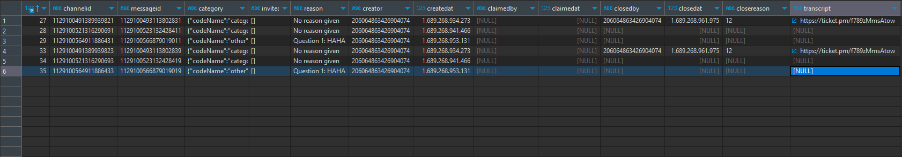
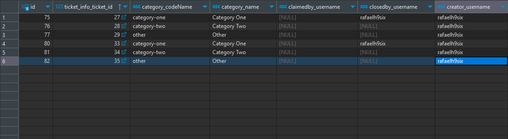

# What I am doing

I'm implementing a django admin panel to the project to have more control over the database and facilitate queries.
I'm not changing anything that could break or affect how the bot works. (All I'm doing in the database is using existing tables, or creating new tables, I'm not changing existing tables.)
If there is no big change in the functioning of the bot, or in its database, I believe it will not break


The purpose of this fork is to transform the table that by default is stored like this:


And create an auxiliary table so that it looks like this:


In Django Admin it is possible to query, search and filter data


# Fork Features
* Request from discord API to get usernames
* Provide ways to query and filter tickets
* CRUD

# How to use
Go to Django folder ```cd django```
(Optional but recommended) create a python virtual environment

For Windows: ```python -m venv .venv```
For Linux: ```python3 -m venv .venv```

To activate the virtual environment:
Windows: ```.\.venv\Scripts\activate```
Linux: ```source venv/bin/activate```

Run ```pip install -r requirements.txt``` to install Django and its dependencies.

Than, you need to go into ticketbotdjango/settings.py and change the constant DATABASES to your postgre database settings, or create a file named local_settings.py and put the constant there
Something like:
```
DATABASES = {
    'default': {
        'ENGINE': 'django.db.backends.postgresql_psycopg2',
        'NAME': 'Ticket-Bot',
        'HOST': '127.0.0.1',
        'USER': 'postgres',
        'PASSWORD': 'password',
        'PORT': '',
    }
}
```

Run ```python manage.py makemigrations``` and ```python managa.py migrate``` to create the new tables.

After that, run the triggers.sql file to create the triggers to insert the actions into the tickets_temp_log.

If you are already using the bot, run the script.py file ONCE, this will already insert all existing rows in the tickets_info table.

After that (or if you haven't used the bot before), whenever you run trigger.py, it will basically do the same thing as script.py, but only for new inserts//updates. The recommended thing would be to leave the file always running, so that every 1 minute it checks the temporary log table.

# How to use django admin

Run ```python manage.py createsuperuser``` and follow the steps to create a super user.

Than, run ```python manage.py runserver``` to start the django server, than enter on your browser http://127.0.0.1:8000/admin, log into yout super user, and you are good to go.