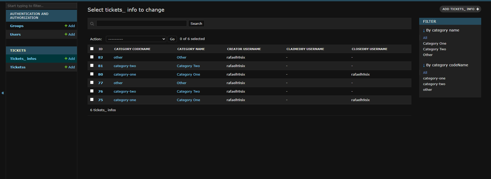

# What I am doing

I'm implementing a django admin panel to the project to have more control over the database and facilitate queries.
I'm not changing anything that could break or affect how the bot works. (All I'm doing in the database is using existing tables, or creating new tables, I'm not changing existing tables.)
If there is no big change in the functioning of the bot, or in its database, I believe it will not break


The purpose of this fork is to transform the table that by default is stored like this:


And create an auxiliary table so that it looks like this:


In Django Admin it is possible to query, search and filter data


# Fork Features
* Request from discord API to get usernames
* Provide ways to query and filter tickets
* CRUD

# How to use
(Optional but recommended) create a python virtual environment

For Windows: ```python -m venv .venv```
For Linux: ```python3 -m venv .venv```

To activate the virtual environment:
Windows: ```.\.venv\Scripts\activate```
Linux: ```source venv/bin/activate```

Run ```pip install -r requirements.txt``` to install Django and its dependencies

Than, you need to go into ticketbotdjango/settings.py and change the constant DATABASES to your postgre database settings, or create a file named local_settings.py and put the constant there
Something like:
```
DATABASES = {
    'default': {
        'ENGINE': 'django.db.backends.postgresql_psycopg2',
        'NAME': 'Ticket-Bot',
        'HOST': '127.0.0.1',
        'USER': 'postgres',
        'PASSWORD': 'password',
        'PORT': '',
    }
}
```

Run ```python manage.py makemigrations``` and ```python managa.py migrate``` to create the new tables

After that, run the triggers.sql file to create the triggers to insert the actions into the tickets_temp_log

If you are already using the bot, run the script.py file ONCE, this will already insert all existing rows in the tickets_info table.

After that (or if you haven't used the bot before), whenever you run trigger.py, it will basically do the same thing as script.py, but only for new inserts//updates. The recommended thing would be to leave the file always running, so that every 1 minute it checks the temporary log table.

# How to use django admin

Run ```python manage.py createsuperuser``` and follow the steps to create a super user

than, run ```python manage.py runserver``` to start the django server, than enter on your browser http://127.0.0.1:8000/admin, log into yout super user, and you are good to go

# Possible future changes
* Convert timestamp from the tickets table, to datetime into tickets_info table

# Ticket Bot

Ticket Bot is a open source project of an ticket discord bot using [discord.js](https://discord.js.org) v14


[](https://app.fossa.com/projects/git%2Bgithub.com%2FSayrix%2FTicket-Bot?ref=badge_shield)

## 📄 Documentation

The documentation is available [here](https://doc.ticket.pm/)

## ⚠️ Incompatibility
This new source code you're seeing are completely refactored and will be incompatible with the older version.
I recommend you finish up all of your remaining support ticket and start migrating to the newer version.
If you prefer to stay in the older version, here is the doc for the old version: https://doc.ticket.pm/docs/oldDoc/intro

## 💬 Discord

You can come on the discord: https://discord.gg/VasYV6MEJy

## ✨ Contributing

Contributions are welcome! Please read the [contributing guidelines](https://github.com/Sayrix/Ticket-Bot/blob/main/CONTRIBUTING.md) first.

## 👨‍💻 Maintainers
Our current project maintainers:
* [Sayrix](https://github.com/Sayrix)
* [小兽兽/zhiyan114](https://github.com/zhiyan114)

## 💎 Sponsors
Thanks to all our sponsors! 🙏  
You can see all perks here: https://github.com/sponsors/Sayrix
<p align="center">
  <a href="https://cdn.jsdelivr.net/gh/sayrix/sponsors/sponsors.svg">
    
  </a>
</p>

## Please leave a ⭐ to help the project!


## License
[](https://app.fossa.com/projects/git%2Bgithub.com%2FSayrix%2FTicket-Bot?ref=badge_large)
